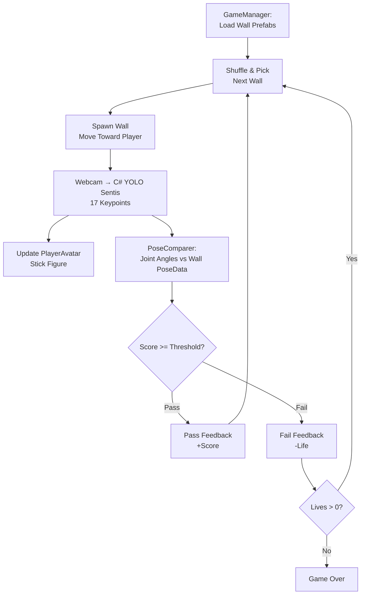

# PoseGame - Project Status & Roadmap

## What Is PoseGame?

A "Hole in the Wall" style game: 3D walls with human-shaped cutouts move toward the player. The player must match the pose using their body (tracked via webcam + YOLO pose detection). Their pose is compared against stored pose data and scored based on joint angle matching.

---

## Current State (What's Built)

### 1. Python Pose Capture Pipeline (COMPLETE)

**Location:** `pose_detection/`

A standalone Python app that captures poses via webcam using YOLO v11 pose estimation.

| File | Purpose |
|------|---------|
| `main.py` | Entry point - live webcam feed with YOLO overlay. Press **S** to snapshot a pose, **Q** to quit. |
| `pose_detector.py` | Wrapper around YOLO v11 pose model. Detects 17 COCO keypoints per person (nose, eyes, ears, shoulders, elbows, wrists, hips, knees, ankles). |
| `webcam.py` | Threaded webcam capture (DirectShow on Windows) for low-latency frame reads. |
| `video_writer.py` | FFmpeg-based H.264 MP4 recorder for annotated output. |
| `poses/` | Output folder - JSON files with normalized (0-1) keypoint coordinates + confidence scores. |

**How it works:**
```
Run main.py -> webcam opens -> YOLO detects skeleton -> user strikes a pose -> press S
-> pose saved as pose_XXX.json with 17 keypoints (x, y, confidence) normalized to frame size
```

**Dependencies:** `opencv-python`, `ultralytics>=8.3.0`, `numpy`, FFmpeg (external)

### 2. Unity Pose Importer (COMPLETE)

**Location:** `Assets/Scripts/Editor/PoseImporter.cs`

Editor tool (Menu > PoseGame > Import Poses from JSON) that reads all JSON files from `pose_detection/poses/` and converts them into Unity `PoseData` ScriptableObjects stored in `Assets/Data/Poses/`.

**PoseData** (`Assets/Scripts/Data/PoseData.cs`):
- 17 keypoints (name, x, y, confidence)
- Display name, difficulty rating
- `GetJointAngle()` method for scoring comparisons (calculates angle between three joints)

### 3. Unity Wall Baker (COMPLETE)

**Location:** `Assets/Scripts/Editor/WallBaker.cs`

Editor tool (Menu > PoseGame > Bake Walls from Poses) that generates 3D wall prefabs from PoseData.

**Bake pipeline:**
1. **Mask** - Creates 1024x1024 boolean grid, inflates skeleton into silhouette (head circles, limb tubes, joint circles, body fill via flood fill)
2. **Texture** - Samples Phoenix3D jungle wall texture, applies alpha cutout from mask, saves as PNG
3. **Materials** - URP Lit shader with alpha clipping for front/back faces + solid inner wall material
4. **Mesh** - Two submeshes: front/back quads with cutout UVs + inner wall edge quads (procedurally generated from edge detection)
5. **Prefab** - Assembles MeshFilter, MeshRenderer, WallPoseRef, BoxCollider into a prefab

**Output:** Prefabs in `Assets/Prefabs/Walls/`, textures in `Assets/Textures/Walls/`, materials in `Assets/Materials/Walls/`

### 4. Nimbus Backend (PARTIAL - not core to game)

**Location:** `Nimbus/backend/`

Flask server with webcam streaming, pub/sub event system, and drone integration. Has video pipeline + state management but is more of an experimental backend, not directly wired into the Unity game loop yet.

---

## What Still Needs To Be Built

### Phase 1: Core Game Environment

#### 1.1 - 3D Environment / Scene
**Status:** NOT STARTED

The game needs a scene where the player stands and walls approach them.

**Minimum viable (wireframe):**
- A ground plane (flat grid or wireframe floor)
- A "lane" or corridor the wall travels down toward the player
- A skybox or simple background color
- Basic lighting (directional light + ambient)
- Camera positioned behind the player, looking down the lane

**Files to create:**
- `Assets/Scenes/Game.unity` - main game scene
- `Assets/Scripts/Runtime/GameEnvironment.cs` - scene setup (optional, can be scene-only)

#### 1.2 - Player Character
**Status:** NOT STARTED

A visual representation of the player that mirrors their detected pose in real-time.

**Minimum viable (stick figure):**
- A root GameObject with 17 joint transforms (matching COCO keypoints)
- Line renderers or thin cylinders connecting joints along the skeleton (12 bone segments)
- Sphere or circle at each joint position
- Head represented as a larger sphere at the nose/head keypoint
- Updates every frame from pose detection input

**Files to create:**
- `Assets/Scripts/Runtime/PlayerAvatar.cs` - stick figure that maps 17 keypoints to joint transforms
- `Assets/Prefabs/Player.prefab` - player stick figure prefab

#### 1.3 - Real-Time Pose Detection (C# / Unity)
**Status:** NOT STARTED

The Python pose capture works for creating poses offline. Now we need the same YOLO pose detection running in real-time within Unity (or streaming to Unity) for gameplay.

**Option A: Native C# with YOLO ONNX (recommended)**
- Export YOLO v11 pose model to ONNX format
- Run inference in Unity using Unity Sentis (neural network inference package) or Barracuda
- Process webcam frames → get 17 keypoints → feed to PlayerAvatar
- Same model, same keypoints, same normalization as the Python pipeline

**Option B: Python backend streaming (fallback)**
- Run the existing Python pose detector as a local server
- Stream keypoints to Unity via WebSocket or UDP
- Lower integration effort but adds a dependency on Python running alongside Unity

**Files to create:**
- `Assets/Scripts/Runtime/WebcamCapture.cs` - Unity webcam texture capture
- `Assets/Scripts/Runtime/PoseDetector.cs` - YOLO ONNX inference (or WebSocket client for Option B)
- Model file: `Assets/StreamingAssets/yolo11n-pose.onnx` (exported from Python)

### Phase 2: Core Game Loop

#### 2.1 - Wall Movement
**Status:** NOT STARTED

Walls need to spawn at a distance and move toward the player at a configurable speed.

**Behavior:**
- Spawn wall prefab at far end of lane (e.g., Z = 30)
- Move toward player at constant speed (adjustable per difficulty)
- When wall reaches player position, trigger pose comparison
- Speed increases as game progresses

**Files to create:**
- `Assets/Scripts/Runtime/WallMover.cs` - moves wall along Z axis toward player

#### 2.2 - Pose Comparison & Scoring
**Status:** NOT STARTED (but PoseData.GetJointAngle() exists)

Compare the player's live pose against the wall's target PoseData.

**Logic:**
- At scoring moment, capture player's current keypoints
- Calculate joint angles for both player and target pose using `GetJointAngle()`
- Compare each joint angle within an error tolerance (e.g., 15-25 degrees)
- Overall score = percentage of joints within tolerance
- Pass threshold: configurable (e.g., 70%)
- Visual/audio feedback for pass or fail

**Files to create:**
- `Assets/Scripts/Runtime/PoseComparer.cs` - angle comparison logic
- `Assets/Scripts/Runtime/ScoreManager.cs` - scoring, pass/fail, streak tracking

#### 2.3 - Game Manager
**Status:** NOT STARTED

Orchestrates the full game loop.

**Responsibilities:**
- Load all wall prefabs from `Assets/Prefabs/Walls/`
- Shuffle and queue walls (no repeats until all played)
- Spawn next wall after previous one is scored
- Track score, lives, level progression
- Increase difficulty (wall speed, tighter tolerances)
- Handle game over state

**Files to create:**
- `Assets/Scripts/Runtime/GameManager.cs` - main game loop controller

### Phase 3: Polish & UI

#### 3.1 - UI
- Countdown timer or distance indicator as wall approaches
- Current score display
- Pass/fail splash feedback
- Game over screen with final score
- Start menu

#### 3.2 - Visual Polish
- Particle effects on pass/fail
- Wall destruction animation on fail
- Better player avatar (animated mesh instead of stick figure)
- Environment decoration (jungle theme matching wall textures)

#### 3.3 - Audio
- Background music
- Sound effects for wall approaching, pass, fail, game over

---

## Implementation Priority

| Priority | Task | Complexity |
|----------|------|------------|
| 1 | 3D environment (wireframe scene) | Low |
| 2 | Player stick figure avatar | Medium |
| 3 | Real-time pose detection in C# | High |
| 4 | Wall movement system | Low |
| 5 | Pose comparison & scoring | Medium |
| 6 | Game manager / game loop | Medium |
| 7 | Basic UI (score, countdown) | Low |
| 8 | Polish (effects, audio, visuals) | Low-Medium |

---

## Tech Stack

| Component | Technology |
|-----------|-----------|
| Engine | Unity 6000.3.11f1 (URP) |
| Pose Capture (offline) | Python + YOLO v11 + OpenCV |
| Pose Detection (runtime) | YOLO v11 ONNX via Unity Sentis (or Python WebSocket fallback) |
| Wall Generation | Custom C# editor tool (WallBaker) |
| 3D Rendering | Universal Render Pipeline (URP) |
| Input | Unity Input System 1.19.0 |
| Backend (optional) | Flask (Nimbus) for streaming/drone integration |

---

## Architecture Diagrams

### Offline: Pose Capture & Wall Baking

```mermaid
flowchart LR
    A[Webcam] --> B[Python YOLO v11\npose_detector.py]
    B --> C[Press S\nSnapshot]
    C --> D[pose_XXX.json\n17 keypoints normalized]
    D --> E[PoseImporter\nEditor Tool]
    E --> F[PoseData\nScriptableObject]
    F --> G[WallBaker\nEditor Tool]
    G --> G1[1024x1024 Mask\nInflate skeleton + flood fill]
    G1 --> G2[Bake Texture\nPhoenix3D + alpha cutout]
    G2 --> G3[Generate Mesh\n2 submeshes + edge quads]
    G3 --> G4[Assemble Prefab\nMesh + Materials + WallPoseRef]
    G4 --> H[(Assets/Prefabs/Walls/)]
```



### Runtime: Gameplay Loop (TO BE BUILT)



### Component Overview

```mermaid
classDiagram
    class PoseData {
        +string displayName
        +int difficulty
        +Keypoint[17] keypoints
        +GetKeypoint(string) Keypoint
        +GetJointAngle(string, string, string) float
    }

    class WallPoseRef {
        +PoseData poseData
    }

    class PoseImporter {
        +ImportFromJSON() void
        -ReadPoseJson(path) PoseData
    }

    class WallBaker {
        +BakeAllWalls() void
        -BuildMask(PoseData) bool[]
        -BakeTexture(bool[]) Texture2D
        -BuildMesh(bool[]) Mesh
        -CreateMaterials() Material[]
    }

    class GameManager {
        +StartGame()
        +NextWall()
        +EndGame()
    }

    class WallMover {
        +float speed
        +MoveTowardPlayer()
    }

    class PoseDetector {
        +Keypoint[17] GetCurrentPose()
    }

    class PlayerAvatar {
        +UpdateFromKeypoints(Keypoint[])
    }

    class PoseComparer {
        +float Compare(PoseData, Keypoint[])
        +float errorTolerance
    }

    PoseImporter --> PoseData : creates
    WallBaker --> PoseData : reads
    WallBaker --> WallPoseRef : attaches
    GameManager --> WallMover
    GameManager --> PoseComparer
    GameManager --> PoseDetector
    GameManager --> PlayerAvatar
    PoseDetector --> PlayerAvatar : feeds keypoints
    PoseDetector --> PoseComparer : feeds keypoints
    PoseComparer --> PoseData : compares against

    style GameManager stroke-dasharray: 5 5
    style WallMover stroke-dasharray: 5 5
    style PoseDetector stroke-dasharray: 5 5
    style PlayerAvatar stroke-dasharray: 5 5
    style PoseComparer stroke-dasharray: 5 5
```

*Dashed outlines = not yet implemented.*

---

## Key Data Flow

```
[OFFLINE - Pose Creation]
Webcam → Python YOLO → press S → JSON file → Unity PoseImporter → PoseData asset → WallBaker → Wall Prefab

[RUNTIME - Gameplay]  
Webcam → C# YOLO (Sentis) → 17 keypoints → PlayerAvatar (stick figure)
                                           → PoseComparer (vs wall's PoseData)
                                           → Score → Pass/Fail

GameManager: Load walls → Spawn → Move toward player → Score at arrival → Next wall → Repeat
```

---

## Project Structure

```
PoseGame/
├── pose_detection/                  [Python - COMPLETE]
│   ├── main.py                      Entry point (webcam + YOLO + snapshot)
│   ├── pose_detector.py             YOLO v11 wrapper (17 COCO keypoints)
│   ├── webcam.py                    Threaded DirectShow capture
│   ├── video_writer.py              FFmpeg H.264 recorder
│   └── poses/                       JSON pose snapshots (pose_001.json, ...)
│
├── Assets/Scripts/                  [Unity]
│   ├── Data/
│   │   ├── PoseData.cs              ScriptableObject - 17 keypoints + angles [COMPLETE]
│   │   └── WallPoseRef.cs           MonoBehaviour - links wall prefab → PoseData [COMPLETE]
│   ├── Editor/
│   │   ├── PoseImporter.cs          JSON → PoseData asset converter [COMPLETE]
│   │   └── WallBaker.cs             PoseData → 3D wall prefab baker [COMPLETE]
│   └── Runtime/
│       ├── GameManager.cs           Game loop controller [TODO]
│       ├── WallMover.cs             Wall movement toward player [TODO]
│       ├── PoseDetector.cs          YOLO ONNX inference in Unity [TODO]
│       ├── PlayerAvatar.cs          Stick figure driven by keypoints [TODO]
│       ├── PoseComparer.cs          Angle comparison & scoring [TODO]
│       └── WebcamCapture.cs         Unity WebcamTexture capture [TODO]
│
├── Assets/Data/Poses/               Generated PoseData assets [COMPLETE]
├── Assets/Prefabs/Walls/            Baked wall prefabs [COMPLETE]
├── Assets/Textures/Walls/           Baked wall textures with alpha cutout [COMPLETE]
├── Assets/Materials/Walls/          Cutout + inner wall materials [COMPLETE]
├── Assets/Phoenix3D/                Jungle wall texture pack (16 variants)
├── Assets/Scenes/Game.unity         Main game scene [TODO]
│
├── Nimbus/backend/                  Flask backend (experimental, not core)
│   ├── app/server.py                Flask app + CORS + blueprints
│   ├── app/hub_threaded.py          Video pipeline + game hub
│   └── app/services/capture/        Webcam + Webots video sources
│
├── docs/
│   └── PROJECT_STATUS.md            This file (source of truth)
│
└── ProjectSettings/                 Unity project config (URP 6000.3.11f1)
```
