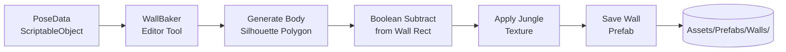
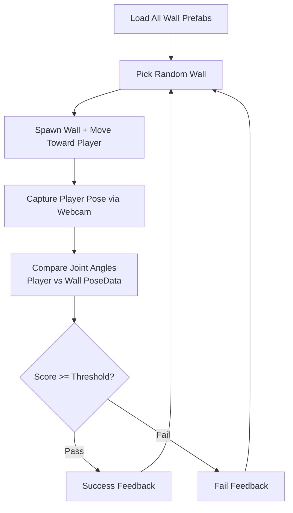
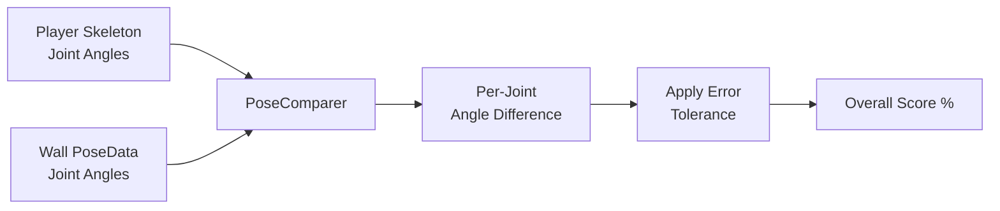
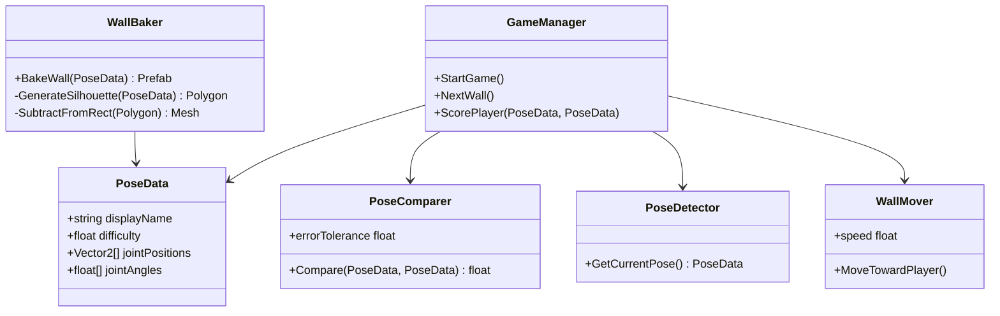

# PoseGame Architecture Diagrams

## Bake Pipeline (Editor-Time)

```mermaid
flowchart LR
    A[PoseData\nScriptableObject] --> B[WallBaker\nEditor Tool]
    B --> C[Generate Body\nSilhouette Polygon]
    C --> D[Boolean Subtract\nfrom Wall Rect]
    D --> E[Apply Jungle\nTexture]
    E --> F[Save Wall\nPrefab]
    F --> G[(Assets/Prefabs/Walls/)]
```

## Runtime Game Loop

```mermaid
flowchart TD
    A[Load All Wall Prefabs] --> B[Pick Random Wall]
    B --> C[Spawn Wall + Move Toward Player]
    C --> D[Capture Player Pose via Webcam]
    D --> E[Compare Joint Angles\nPlayer vs Wall PoseData]
    E --> F{Score >= Threshold?}
    F -->|Pass| G[Success Feedback]
    F -->|Fail| H[Fail Feedback]
    G --> B
    H --> B
```

## Pose Comparison

```mermaid
flowchart LR
    A[Player Skeleton\nJoint Angles] --> C[PoseComparer]
    B[Wall PoseData\nJoint Angles] --> C
    C --> D[Per-Joint\nAngle Difference]
    D --> E[Apply Error\nTolerance]
    E --> F[Overall Score %]
```

## Component Overview

```mermaid
classDiagram
    class PoseData {
        +string displayName
        +float difficulty
        +Vector2[] jointPositions
        +float[] jointAngles
    }

    class WallBaker {
        +BakeWall(PoseData) Prefab
        -GenerateSilhouette(PoseData) Polygon
        -SubtractFromRect(Polygon) Mesh
    }

    class GameManager {
        +StartGame()
        +NextWall()
        +ScorePlayer(PoseData, PoseData)
    }

    class PoseDetector {
        +GetCurrentPose() PoseData
    }

    class PoseComparer {
        +Compare(PoseData, PoseData) float
        +errorTolerance float
    }

    class WallMover {
        +speed float
        +MoveTowardPlayer()
    }

    GameManager --> PoseComparer
    GameManager --> PoseDetector
    GameManager --> WallMover
    WallBaker --> PoseData
    GameManager --> PoseData
```
